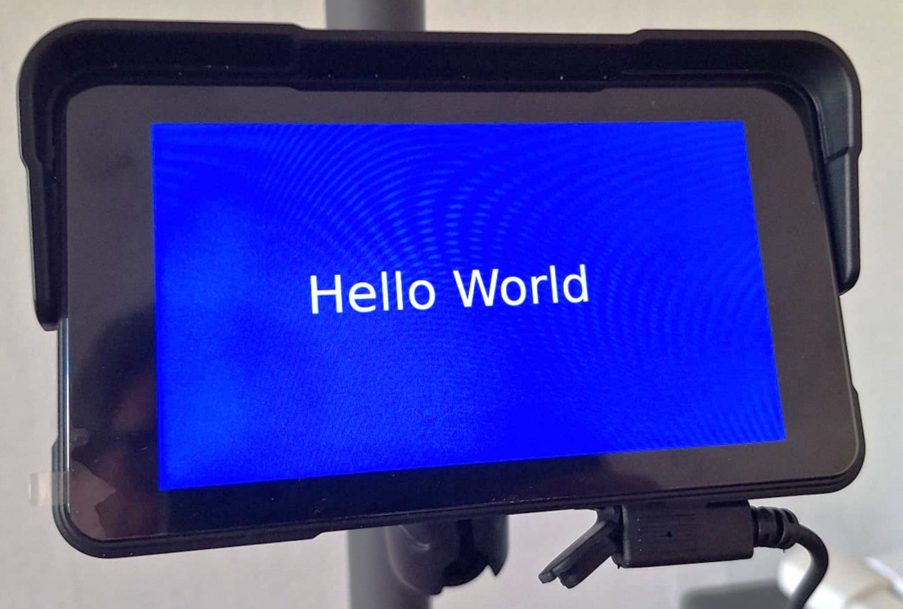

# aa-hmi

A generic display-server daemon for cheap wireless Android-Auto-style
head units — the kind that host their own WiFi AP and hand out custom
video/touch access to whatever phone asks over Bluetooth first. `aa-hmi`
does everything needed to turn one of these into a touchscreen output for
**any separate program**: Bluetooth scan/pair, WiFi-credential bootstrap
and connect, the TCP/TLS video session with the display, and a small
local socket protocol so your own program can push rendered frames in and
get touch events back out — without knowing anything about Bluetooth, AA
Wireless, or TLS.

```bash
aa-hmi serve                     # bootstrap + hold the display session + serve IPC
python3 examples/clock.py        # a separate program, talking only to the socket protocol
```

## Status

**Working end-to-end** against a real Podofo / TF811BT motorcycle display
(see [Tested with](#tested-with)):

- **Bluetooth + WiFi bootstrap** (`aa-hmi run`): confirmed working.
- **Daemon mode** (`aa-hmi serve`): bootstrap → TCP/TLS session → video
  and touch channels → your program pushes frames over the local IPC
  socket. **Stable for long runs**: `examples/clock.py` ran overnight at
  2 images/s — 11h22m, 80,701 images — on one session, without a freeze
  or a reconnect.
- **Frame rate**: encoding takes ~10ms per image on a Pi 4 (one
  long-running `ffmpeg`), so 5+ images/s is realistic. Meant for
  dashboards and maps, not smooth video. `--encoder per-image` falls back
  to one `ffmpeg` run per image (~330ms, max ~3 images/s), proven
  overnight.
- **Touch**: your program gets PRESS / DRAG / RELEASE events with x/y
  in its own image's coordinates, verified accurate over the whole
  screen. Any touch also shows the display's own volume/brightness popup
  in the bottom right corner (see
  [Known hardware quirks](#known-hardware-quirks)).

## What this is

- **Is**: the whole "connect to this display and let a separate program
  use it" layer — Bluetooth, WiFi, TLS video session, touch relay, and a
  documented local socket protocol any language can talk to.
- **Two levels of use**: `aa-hmi run` alone if you just want WiFi
  credentials/connectivity (a building block, useful on its own);
  `aa-hmi serve` for the full daemon.
- **Supersedes** the sibling `aa_pi2display` project, which proved the
  underlying TCP/TLS video-streaming approach works but was always a
  one-shot script, never something another program could build on.
  `aa_pi2display` is kept around for its protocol research/reverse-engineering
  value (`real-protocol-findings.md` is genuinely extensive), not as
  something to keep running day to day.
- **Isn't** a GUI toolkit or a content renderer — it moves already-rendered
  RGB frames to the display and relays touch events back, nothing more.
  What to actually draw is up to your own program (see
  [`examples/`](examples/) for the simplest possible ones).

## Prerequisites

- Linux with [BlueZ](http://www.bluez.org/) (`bluetoothctl`) and
  [NetworkManager](https://networkmanager.dev/) (`nmcli`) — both are
  installed by default on Raspberry Pi OS.
- **For `aa-hmi serve` (daemon mode) only**: `openssl` (self-signed cert,
  auto-generated on first run) and `ffmpeg` (H.264 encoding).
  `aa-hmi run` alone needs neither.
- Python 3.9+. **Zero pip runtime dependencies for `aa-hmi` itself** —
  only the standard library (including `socket.AF_BLUETOOTH`/`BTPROTO_RFCOMM`
  for RFCOMM and `socket.AF_UNIX` for the local IPC socket) and shelling
  out to `bluetoothctl`/`nmcli`/`openssl`/`ffmpeg` as separate processes.
  Pillow is only needed by the *example client apps* (`pip install -e
  .[examples]`), not by `aa-hmi` itself — your own content-producing
  program can use whatever rendering approach it wants.
- A Bluetooth adapter, obviously, and a target head unit that's powered
  on and discoverable.

## Install

```bash
git clone https://github.com/Plek324/aa-hmi.git
cd aa-hmi
```

**Plain `pip install .` will likely fail** on current Raspberry Pi
OS/Debian with `error: externally-managed-environment` (PEP 668 — the
system Python refuses `pip install` outside a virtual environment,
confirmed on Raspberry Pi OS/Debian Trixie). Pick one:

```bash
# Recommended for regular use: pipx (an isolated venv per app, puts
# `aa-hmi` on your PATH)
sudo apt install pipx   # if you don't already have it
pipx install .

# Or a plain venv, if you'd rather not install pipx
python3 -m venv .venv
.venv/bin/pip install .
.venv/bin/aa-hmi run

# To hack on it (editable install):
pipx install -e .   # or: .venv/bin/pip install -e .[dev]
```

Or run it straight from a clone without installing anything — note the
package lives under `src/`, so it needs to be on `PYTHONPATH` explicitly
(a bare `python -m aa_hmi run` from the repo root will fail with `No
module named aa_hmi`):

```bash
PYTHONPATH=src python3 -m aa_hmi run
```

## Usage

### First run (interactive)

```bash
aa-hmi run
```

This scans for nearby Bluetooth devices, lets you pick one, pairs with
it, discovers the right RFCOMM channel, runs the bootstrap handshake, and
joins the resulting WiFi network — caching everything along the way.

```
Bluetooth devices found:
  1. TF811BT_1c64201a  [AA:BB:CC:DD:EE:FF]
  2. My Headphones     [11:22:33:44:55:66]
Select a device [1-2] (or blank to cancel): 1
...
SSID: TF811-1c64201a
Password: 12345678
Connected -- IP address: 192.168.10.42
```

### Subsequent runs

```bash
aa-hmi run
```

With exactly one cached device, this skips the picker and goes straight
to: connect on the known RFCOMM channel, re-run the handshake (still
required every time — the head unit's WiFi listener typically only opens
right after a fresh Bluetooth-triggered session, even with credentials
already known), join WiFi. Noticeably faster than the first run since
channel discovery is skipped too.

Force a fresh scan/pick with `--rescan`, or target a specific cached
device non-interactively with `--device MAC --non-interactive`.

### As a building block

```bash
aa-hmi run --no-wifi-connect --json
```

Runs the Bluetooth bootstrap only, skips the `nmcli` step, and prints the
credentials as JSON on stdout — useful if some other tool wants to do its
own WiFi connection logic.

### Daemon mode

```bash
aa-hmi serve
```

Does everything `run` does (bootstrap, connect), then holds the TCP/TLS
video session open and listens on a local Unix socket
(`$XDG_RUNTIME_DIR/aa-hmi/video.sock` by default) for a separate program
to push rendered frames to and receive touch events from — see
[`docs/ipc-protocol.md`](docs/ipc-protocol.md) for the full wire spec.
Defaults to non-interactive (an unattended daemon must never block on a
prompt) — cache a device with `aa-hmi run` first, or pass `--device MAC`.

In another terminal (or your own program, anywhere, in any language that
can open a Unix socket):

```bash
python3 examples/clock.py            # --interval SECONDS, default 5
```

See [`examples/`](examples/) for the simplest possible clients
(`hello_world.py`, `clock.py`) using the reference Python client library,
`aa_hmi.ipc.client.AaHmiClient` — that library (or the wire spec directly,
in another language) is the entire interface your own program needs; it
never touches anything else in `aa-hmi`.

On any drop of the video session (display power-cycled, moved out of
range, etc), `serve` automatically re-runs the full bootstrap and
reconnects. For unattended/boot-time operation, see
[`deploy/systemd/aa-hmi.service`](deploy/systemd/aa-hmi.service) — **read
its comment about the polkit/nmcli permission issue first**, or the
service will fail at the WiFi-connect step every time.

## CLI reference

```
aa-hmi run [options]        # scan/pair/bootstrap/connect (default command)
  --rescan                  force a fresh BT scan + picker even if cached
  --device MAC              target a specific device
  --channel N                force an RFCOMM channel, skip discovery
  --non-interactive          never prompt; fail if no usable cached device
  --no-wifi-connect          stop after the handshake; print credentials only
  --json                     machine-readable result on stdout
  --radio-coexistence-workaround / --no-radio-coexistence-workaround
                              disconnect WiFi before the BT step (for combo
                              WiFi+BT chips that can't use both at once,
                              e.g. the Raspberry Pi's onboard BCM4345C0).
                              Default: off for run, ON for serve (see below)
  --wifi-iface IFACE         WiFi interface to use (default: autodetect)
  --bt-timeout SECONDS       total retry budget for the Bluetooth stage (default: 90)
  --scan-duration SECONDS    BT scan duration (default: 10)
  --config-dir PATH          override the cache directory
  -v, --verbose

aa-hmi serve [options]      # full daemon: bootstrap + hold display session + serve IPC
  (all of `run`'s bootstrap flags above, EXCEPT --no-wifi-connect/--json, plus:)
  --non-interactive           defaults to true for serve (unlike run)
  --radio-coexistence-workaround defaults to true for serve too (unlike run) --
                              serve's reconnect loop redoes the full BT bootstrap
                              on every drop, so this matters every time, not just once
  --socket-path PATH         IPC socket location (default: $XDG_RUNTIME_DIR/aa-hmi/video.sock)
  --display-ip IP            display's IP on its own WiFi AP (default: 192.168.10.1)
  --cert PATH, --key PATH    TLS cert/key paths (default: auto-generated under --config-dir)
  --reconnect-max-attempts N  give up after N consecutive reconnect failures (default: retry forever)
  --liveness-timeout SECONDS reconnect if the display sends nothing at all for this long, even if the
                              connection otherwise looks fine (default: 60; 0 disables). See
                              docs/video-protocol-notes.md
  --keepalive SECONDS        resend the last image after this long without a new one, so programs
                              can send only on changes (default: 10; 0 disables)
  --encoder MODE             persistent (default, ~10ms/image) or per-image (~330ms/image, the
                              proven fallback)
  --video-size WxH           video resolution (default: 800x480, what the Podofo display asks for;
                              the log shows what yours asks for)
  --margins WxH              video edges that may not be visible; client programs draw the area
                              inside, centred (default: 18x40 -> programs draw 782x440; 0x0 = full)

aa-hmi list                  show cached devices
aa-hmi forget <mac-or-name>  remove one cached device
aa-hmi forget --all          remove every cached device
```

## How it works

Android-Auto-Wireless-style bootstrap is symmetric by design: the head
unit doesn't authenticate *which* phone is asking, it just answers the
opening Bluetooth handshake with its own WiFi AP credentials
(`WifiInfoResponse`: ssid, key, bssid, security_mode). So a tool that can
speak just the phone's side of that opening handshake gets the
credentials for free, without doing anything resembling a full Android
Auto session. See [`docs/protocol-notes.md`](docs/protocol-notes.md) for
the full wire-level writeup.

Once WiFi is up, `serve` opens a second, separate protocol over TCP/TLS
(port 29880) — a real TLS 1.2 handshake, then a video channel and a touch
channel multiplexed over it. See
[`docs/video-protocol-notes.md`](docs/video-protocol-notes.md) for that
side, including the one genuinely tricky bug (a TLS-handshake-completion
ordering issue), how images are encoded, and why each image must be one
message. The local socket protocol bridging that to your own program is
documented separately in [`docs/ipc-protocol.md`](docs/ipc-protocol.md).

## Tested with

Confirmed working end-to-end (see [Status](#status)) on this exact
combination — other hardware/OS/software versions will very likely work
too, but haven't been verified:

- **Raspberry Pi**: Raspberry Pi 4 Model B Rev 1.2
- **OS**: Debian GNU/Linux 13 "trixie" (Raspberry Pi OS 64-bit, aarch64),
  kernel `6.18.39+rpt-rpi-v8`
- **Python**: 3.13.5 (stock system Python, no extra packages needed at
  runtime)
- **BlueZ** (`bluetoothctl`): 5.82
- **NetworkManager** (`nmcli`): 1.52.1
- **Head unit**: a **Podofo 5" motorcycle Android Auto display**
  (bought on AliExpress). Its Bluetooth/WiFi firmware identifies itself
  as `TF811BT_xxxxxxxx` / SSID `TF811-xxxxxxxx` — "Podofo" is just the
  retail brand this specific unit is sold under; `TF811BT` looks like the
  actual chipset/module name baked into the firmware, and several
  differently-branded AliExpress motorcycle/car displays are known to
  reuse the same white-label internals, so this project's findings may
  apply more broadly than just to units sold as "Podofo."

  

  The actual unit, showing custom video content ("Hello World") pushed
  to it by the sibling `aa_pi2display` project — the original proof that
  this whole approach works, and the milestone this tool's own
  WiFi-bootstrap piece was later extracted from.

If you try this against different hardware, please open an issue/PR
either way (works identically, or behaves differently) — see
[`docs/capturing-ground-truth.md`](docs/capturing-ground-truth.md) for
the Bluetooth-protocol side and the quirks below for what's already
known to vary.

## Known hardware quirks

These come from real testing against one specific head unit (the Podofo
display in [Tested with](#tested-with) above, TF811BT-based) during the
sibling `aa_pi2display` project — your hardware may behave differently,
but these are worth knowing about:

- **Single Bluetooth connection slot.** Many of these head units' classic
  BT radio only holds one connection at a time. If a phone (or anything
  else) is currently connected, bootstrap will fail with confusing
  low-level errors that look like flakiness but really mean "something
  else is holding the radio" — disconnect it there first.
- **Classic Bluetooth can be intermittently unresponsive** for no obvious
  reason, sometimes for several minutes at a stretch. `aa-hmi` retries
  with backoff and a generous default time budget (`--bt-timeout`); if
  it's still failing after a long stretch, try power-cycling the head
  unit.
- **SDP discovery for the AA Wireless RFCOMM channel may not work at
  all** — `aa-hmi` tries it opportunistically but always falls back to a
  validated brute-force scan of channels 1–30.
- **WiFi/Bluetooth radio coexistence** on some client hardware (e.g. the
  Raspberry Pi's onboard combo chip) — active WiFi can starve outbound
  Bluetooth connectivity entirely. `--radio-coexistence-workaround`
  disconnects WiFi before the Bluetooth step as a workaround — on by
  default for `serve` (its own reconnect loop hits this on every drop,
  not just once), opt-in for `run`, since it's specific to certain client
  hardware, not universal.
- **Something can wedge fully unresponsive after rapid reconnect
  cycling** — confirmed by `ping`ing the head unit's gateway address
  returning 100% packet loss while its Bluetooth/RFCOMM service kept
  responding normally. **Root cause still unconfirmed**: a head unit
  power cycle alone did *not* fix it for one user; a Raspberry Pi reboot
  did — points at the Pi's own combo-chip driver/radio state more than
  the head unit's AP, but isn't nailed down yet (persistent logging is
  now enabled so a future occurrence can actually be diagnosed). Don't
  rapid-cycle `aa-hmi serve` start/stop against real hardware while
  testing/developing. See
  [`docs/video-protocol-notes.md`](docs/video-protocol-notes.md).
- **The display's video decoder wedges if an image arrives as several
  messages** (fixed) — it silently stopped updating after 1–145 images
  while `aa-hmi` kept sending without errors. Cause: the encoder cut each
  image into 4 slices, each sent as its own message; a phone sends one
  whole picture per message. Now one slice = one message per image, and
  an overnight test (80,701 images) ran without a freeze.
  `--liveness-timeout` (default 60s) remains as a safety net. Details in
  [`docs/video-protocol-notes.md`](docs/video-protocol-notes.md).
- **The credential cache stores your WiFi password in plaintext** (with
  `0600` file permissions) at `$XDG_CONFIG_HOME/aa-hmi/devices.json`
  (usually `~/.config/aa-hmi/devices.json`). It's a local convenience
  cache, not a secrets vault.
- **Any touch shows the display's own popup** in the bottom right
  corner: a volume slider and a brightness slider (handy). It hides
  itself after a timeout and can be dragged elsewhere; touches on it go
  to the display, not to your program. Keep important controls out of
  the bottom right corner. See
  [`docs/video-protocol-notes.md`](docs/video-protocol-notes.md).
- **`nmcli` connect fails with "property is missing"**: a stale
  NetworkManager connection profile for that SSID is probably missing
  required security settings. `aa-hmi` already deletes any existing
  profile by that name before connecting — if you still hit this outside
  of `aa-hmi`, try `nmcli connection delete '<ssid>'` manually first.
- **`nmcli` connect fails with "Not authorized to control networking"**:
  a polkit permissions issue, not a bug — confirmed live: a plain SSH
  session with no active console/logind session doesn't get
  NetworkManager's default allow-without-auth policy on some distros,
  even though read-only nmcli commands (like listing WiFi networks) work
  fine from the same session. **Recommended fix (one-time, ~30s, no more
  `sudo` needed afterward):** [`docs/networkmanager-permissions.md`](docs/networkmanager-permissions.md).
  Quick alternative: `sudo $(command -v aa-hmi) run` — plain `sudo
  aa-hmi` won't find the command if you installed via `pipx`, since
  `~/.local/bin` isn't on `sudo`'s `secure_path` (confirmed live too).
- **"no RFCOMM channel ... spoke the expected protocol"**: either the
  head unit isn't actually an AA-Wireless-style device, or its RFCOMM
  channel assignment doesn't match what `aa-hmi` expects (channel numbers
  have been observed to shift over time on the same unit — see
  [`docs/protocol-notes.md`](docs/protocol-notes.md) — a plain rescan
  should find it again).
- **Pairing hangs or fails**: check `bluetoothctl` directly
  (`bluetoothctl pair <MAC>`) to see the raw prompt/error; `aa-hmi`
  auto-confirms passkey/authorization prompts during pairing (see
  [Security notes](#security-notes)) but can't do anything about a head
  unit that's simply not responding — see the single-connection-slot and
  flaky-classic-BT quirks above.

## Contributing

Issues and PRs welcome — especially:
- Reports of how these quirks (or new ones) show up on different head
  units — the "known hardware quirks" section above is based on exactly
  one device so far.
- A D-Bus discovery backend — see
  [`docs/discovery-backends.md`](docs/discovery-backends.md) for the seam
  it should slot into.
- Working through [`docs/video-live-verification.md`](docs/video-live-verification.md)'s
  staged checklist on your own hardware and reporting results either way.

Run the test suite with `pytest` (no hardware needed — see
[`tests/`](tests/); protocol/cache/retry/IPC-framing logic is fully
unit-tested — `ffmpeg`/`openssl`-dependent and `AF_UNIX`-dependent tests
skip cleanly when those aren't available on your platform — live-hardware
verification is a separate manual process documented alongside the code).

## Security notes

- Pairing auto-confirms any passkey/service-authorization prompt it sees
  (logged, never silent) — appropriate for the low-security consumer
  head units this targets, not for a general Bluetooth-pairing tool. See
  [`docs/discovery-backends.md`](docs/discovery-backends.md).
- The credential cache holds a plaintext WiFi password on disk (0600
  permissions) — treat it like any other local WiFi credential store, not
  a secrets vault.
- The daemon's local IPC socket (`$XDG_RUNTIME_DIR/aa-hmi/video.sock`) is
  `0600`/local-machine-only by design, not a network service — anything
  that can open a Unix socket on the same machine can connect (there's no
  further auth), which is fine for its intended single-user-Pi use case
  but worth knowing if you're on a genuinely shared machine.

## License

MIT — see [`LICENSE`](LICENSE). This project has zero bundled/vendored
runtime dependencies; it shells out to separately-installed system tools
(`bluetoothctl`, `nmcli`) as external processes rather than linking
against them.
